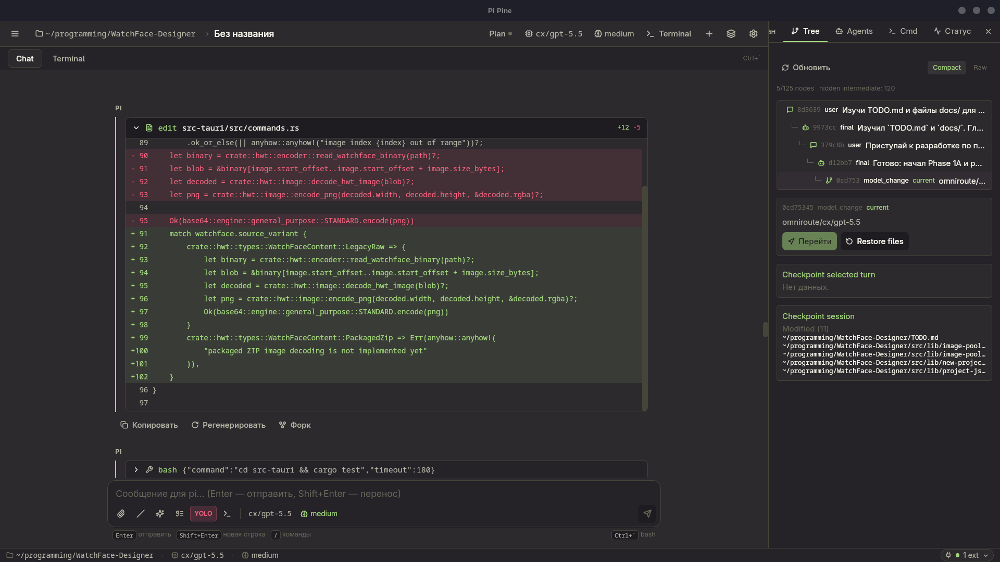
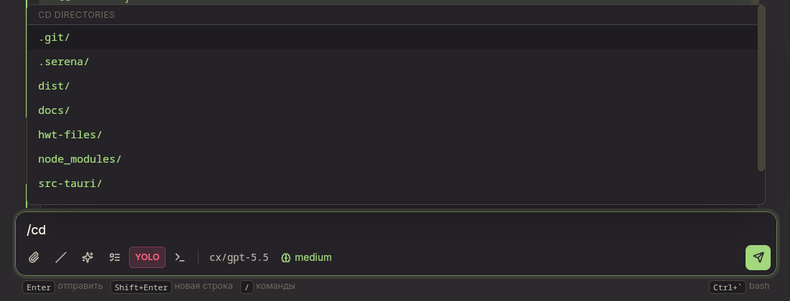

<p align="center">
    
</p>

<h1 align="center">Pi Pine</h1>

<p align="center">
    Минималистичный десктоп-фронтенд для <a href="https://github.com/BloodyAngel22/pi-mono-x">pi-mono-x</a> — форка AI-кодинг-агента <a href="https://pi.dev/">pi</a>.<br/>
    Pi запускается как CLI и выводит в консоль огромный поток информации: thinking-блоки, tool-calls,
    статусы MCP — всё это смешивается в сплошной поток текста, которым неудобно пользоваться.
    Pi Pine решает именно эту проблему: это тонкая обёртка вокруг <code>pi --mode rpc</code>,
    которая убирает шум CLI и даёт чистый однооконный диалог с агентом.
</p>

> **Стек**: Tauri 2 · Rust · React 18 · TypeScript · Vite · Tailwind CSS 4 · Zustand · xterm.js  
> **Статус**: alpha / MVP

---

<table>
<tr>
<td width="50%">

**Чат · tool-calls**



</td>
<td width="50%">

**Встроенный терминал**


</td>
</tr>
<tr>
<td colspan="2">

**`/cd` с Tab-автодополнением директорий**



</td>
</tr>
</table>

---

## Чем отличается от pi CLI

| | pi CLI | Pi Pine |
|---|---|---|
| Интерфейс | Терминал | Нативный десктоп (Tauri, ~6 МБ) |
| Вывод thinking / tool-calls | Сырой поток в консоль | Компактные сворачиваемые блоки |
| Навигация по сессиям | Флаги и файлы вручную | Сайдбар, переименование, удаление |
| Форк / регенерация / редактура | Нет | Встроено в UI каждого сообщения |
| MCP-статусы | Смешаны с выводом агента | Отдельная статус-строка |
| Терминал | Отдельное окно | Встроенный таб с xterm.js |
| Управление cwd | `cd` в оболочке | `/cd` с Tab-автодополнением |

## Возможности

### Чат

- Потоковый чат с автосклейкой `message_update`-дельт.
- **Thinking-блоки** и **tool-calls** — свёрнуты по умолчанию, разворачиваются по клику.
- **Регенерировать** — откатывает сессию до родительского запроса и повторяет его.
- **Форк** — создаёт новую ветку сессии от выбранного сообщения.
- **Редактировать** — откатывает до выбранного запроса и подставляет текст в поле ввода.
- **Режим очереди** — направляет или добавляет запрос пока агент ещё отвечает.
- Markdown с подсветкой кода, нормализация вывода модели (плотные списки, emoji-секции).

### Модель и мышление

- **Выбор модели и провайдера** из `get_available_models` с поиском.
- **Thinking level**: off → minimal → low → medium → high → xhigh.

### Сессии

- **Сайдбар сессий** — переключение, переименование, удаление сессий из `~/.pi/agent/sessions/`.
- **Поиск по истории** — поиск промптов в текущей сессии.

### Slash-команды

| Команда | Описание |
|---|---|
| `/new` | Новая сессия |
| `/sessions` | Открыть сайдбар сессий |
| `/model` | Сменить модель |
| `/compact` | Сжать контекст |
| `/settings` | Настройки |
| `/cd <path>` | Сменить рабочую директорию агента (с Tab-автодополнением) |
| `/pwd` | Показать текущую рабочую директорию |
| `/ls [path]` | Показать файлы в директории |
| `/search` | Поиск по prompt истории |
| `/execute` | Выполнить текущий план |
| `/btw <вопрос>` | Попутный вопрос в текущем контексте |
| `/abort` | Прервать стриминг |

`/cd` поддерживает автодополнение директорий через `Tab` — как в терминале.  
Поддерживаются абсолютные (`/home/...`), относительные (`src/`) и `~/` пути.

### Терминал

- **Встроенный терминал** на базе xterm.js + portable-pty (Rust).
- Переключение между чатом и терминалом: отдельный таб или `Ctrl+\``.
- Split (вертикальный) — два терминала одновременно.
- Буфер и состояние терминала сохраняются при переключении табов.
- Поддержка Nerd Fonts (Unicode 11) для ZSH-иконок и powerline-шрифтов.
- Адаптивный resize для tmux и split panes.

### План и скиллы

- **Режим плана** — ограничивает агента markdown-файлом плана, запускается кнопкой «Реализуй».
- **Палитра скиллов** (`Ctrl+/`) — выбор `/skill:name` из установленных скиллов pi.

### Настройки

- **Управление MCP** — вкладка ⚙ → MCP: список серверов, включение/отключение.
- **Темы** — выбор цветовой схемы из встроенных тем.
- **Избранное** — закреплённые настройки провайдеров и моделей.
- **Отслеживание** `auth.json` — автообновление при входе/выходе из pi без перезапуска.
- **Запуск с cwd-аргументом**: `pi-pine .` / `pi-pine ~/myproject`.
- Карточка первого запуска, если `pi` не найден; ручное указание пути в настройках.

### Прочее

- Компактный **статус-бар**: cwd · модель · токены · стоимость · расширения.
- **Панель команд** — запуск shell-команд из интерфейса.
- **Yolo mode** — автоматическое одобрение запросов агента.

## Известные ограничения

- Только Linux (webkit2gtk). macOS/Windows — в планах.
- Protocol Extension UI (`ctx.ui.notify/select/confirm/...`) — частичная поддержка.
- Дерево файлов и просмотр diff — не реализованы.
- Несколько панелей сессий одновременно — не реализовано.

## Требования

- **[pi-mono-x](https://github.com/BloodyAngel22/pi-mono-x/tree/feature/pi-pine-rpc-integration)** — форк pi с расширенным RPC-протоколом.  
  Pi Pine **не совместим** с оригинальным [pi](https://pi.dev/) — требуется именно pi-mono-x,
  ветка `feature/pi-pine-rpc-integration`, в которой добавлены RPC-команды `cd`, `pwd`, `ls`
  и другие расширения протокола.

  ```bash
  git clone --branch feature/pi-pine-rpc-integration https://github.com/BloodyAngel22/pi-mono-x
  cd pi-mono-x
  npm install
  npm run build
  # бинарь: packages/coding-agent/dist/cli.js
  ```

  Pi Pine ищет бинарь `pi` в `PATH`, `~/.nvm/`, `~/.volta/`, `~/.local/share/fnm/`.
  Если не нашёл — укажите путь вручную в настройках (⚙).
- **Node.js ≥ 22** и **Rust** (stable) — для сборки из исходников.
- **Linux**: `libwebkit2gtk-4.1-0`, `librsvg2-2`.

```bash
# Ubuntu/Debian
sudo apt install libwebkit2gtk-4.1-dev librsvg2-dev
```

## Запуск из исходников

```bash
git clone <repo> pi-pine
cd pi-pine
npm install
npm run tauri:dev          # dev-сервер с горячей перезагрузкой
```

### Запуск в конкретном проекте

```bash
# открыть в текущей директории
./src-tauri/target/debug/pi-pine .

# или передать путь явно
./src-tauri/target/debug/pi-pine ~/projects/myapp
```

## Сборка

```bash
npm run tauri:build
# Артефакты:
#   src-tauri/target/release/pi-pine                     — ELF-бинарь
#   src-tauri/target/release/bundle/deb/*.deb             — .deb (Debian/Ubuntu)
#   src-tauri/target/release/bundle/appimage/*.AppImage   — AppImage
```

Без бандлов (быстрее):

```bash
npx tauri build --no-bundle
./src-tauri/target/release/pi-pine
```

## Горячие клавиши

| Клавиша | Действие |
|---|---|
| `Ctrl+B` | Сайдбар сессий |
| `Ctrl+,` | Настройки |
| `Ctrl+N` | Новая сессия |
| `Ctrl+\`` | Переключение чат / терминал |
| `Ctrl+/` | Палитра скиллов |
| `Enter` | Отправить сообщение |
| `Shift+Enter` | Перенос строки |
| `↑` / `↓` | История ввода (когда поле пустое) |
| `Esc` | Прервать стриминг |
| `Tab` | Автодополнение: slash-команды или директории (`/cd`) |

## Архитектура

```
React UI (Vite + Tailwind + Zustand + xterm.js)
  ↕  invoke / listen   (@tauri-apps/api)
Tauri (Rust): rpc.rs · terminal.rs · paths.rs · sessions.rs · plans.rs · mcp.rs · themes.rs · favorites.rs
  ↕  stdin/stdout (JSONL, LF only)           ↕  portable-pty (PTY)
pi --mode rpc  (pi-mono-x)                            shell (bash/zsh)
  ↕
~/.pi/agent/{auth,settings,sessions,extensions,mcp-config}.*
```

- **`src-tauri/src/rpc.rs`** — спавн `pi --mode rpc`, JSONL-парсер, очистка ANSI, события `rpc://line/stderr/closed`.
- **`src-tauri/src/terminal.rs`** — встроенный терминал: спавн PTY через `portable-pty`, ввод/вывод, resize, kill.
- **`src-tauri/src/paths.rs`** — поиск бинарника `pi`, автодополнение директорий, чтение `auth.json`, watcher.
- **`src-tauri/src/sessions.rs`** — список, переименование, удаление, обрезка `*.jsonl`-файлов сессий.
- **`src-tauri/src/plans.rs`** — режим плана: markdown-файлы в `<cwd>/.pi/plans/`.
- **`src-tauri/src/mcp.rs`** — чтение и редактирование `mcp-config.json`: список серверов, включение/отключение.
- **`src-tauri/src/themes.rs`** — загрузка и выбор цветовых тем.
- **`src-tauri/src/favorites.rs`** — избранные настройки провайдеров и моделей.
- **`src/rpc/bridge.ts`** — типизированный RPC с сопоставлением запрос/ответ по `id`.
- **`src/store/chat.ts`** — Zustand: события pi → UI-блоки, форк/регенерация/редактирование через `navigate_tree`, cwd-команды.

## Где хранятся данные pi

- `~/.pi/agent/auth.json` — токены провайдеров (чтение + отслеживание).
- `~/.pi/agent/settings.json` — настройки CLI (чтение/запись через настройки).
- `~/.pi/agent/sessions/<encoded-cwd>/*.jsonl` — сессии (чтение/запись/удаление).
- `~/.pi/agent/mcp-config.json` — конфигурация MCP-серверов (чтение/запись через ⚙ → MCP).
- `~/.pi/agent/extensions/mcp/` — расширение pi, реализующее подключение MCP-серверов.
- `<cwd>/.pi/plans/` — файлы планов (чтение/запись).

Кодирование cwd: `/home/user/foo` → `--home-user-foo--` (совместимо с pi CLI).

## Устранение проблем

**`pi` не найден при запуске**  
→ Соберите [pi-mono-x](https://github.com/BloodyAngel22/pi-mono-x) и добавьте бинарь в `PATH`.  
→ Или укажите путь вручную в настройках (⚙ → «Путь к pi»).

**Ошибка webkit/librsvg при сборке**  
→ `sudo apt install libwebkit2gtk-4.1-dev librsvg2-dev`

**Сессии не отображаются в сайдбаре**  
→ Проверьте, что cwd совпадает с тем, где создавались сессии.  
→ Pi хранит сессии в `~/.pi/agent/sessions/<encoded-cwd>/`.

**MCP не инициализируется / зависает**  
→ Проверьте конфиг MCP в настройках (⚙ → MCP).  
→ Попробуйте «Безопасный режим» (кнопка в баннере ошибки).

**Терминал: иконки ZSH/powerline не отображаются**  
→ Установите шрифт с Nerd Fonts, например MesloLGS NF или JetBrainsMono NF.

## Лицензия

MIT — см. [LICENSE](LICENSE).
