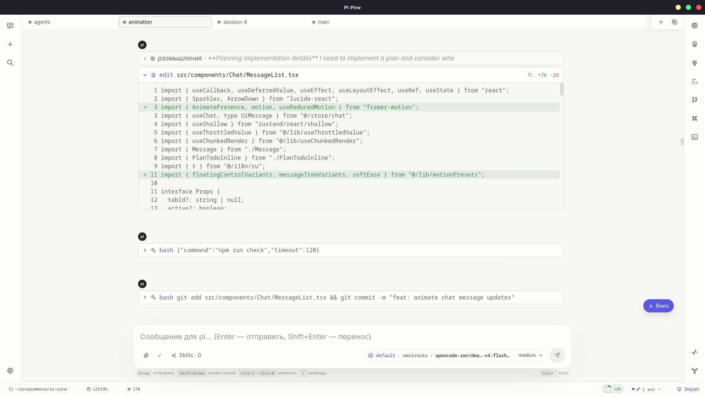
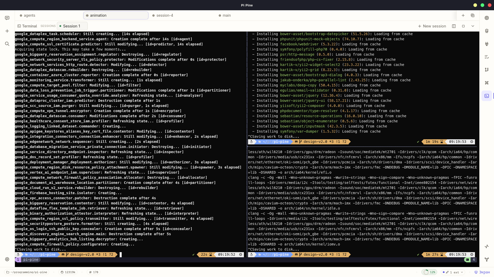
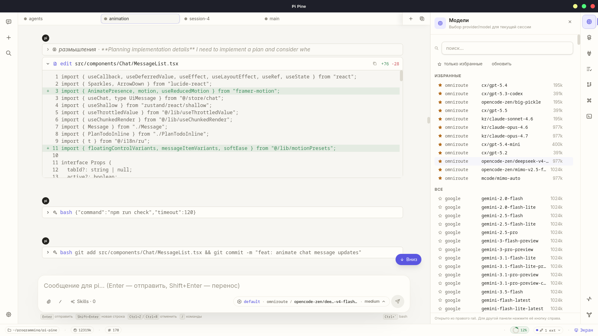
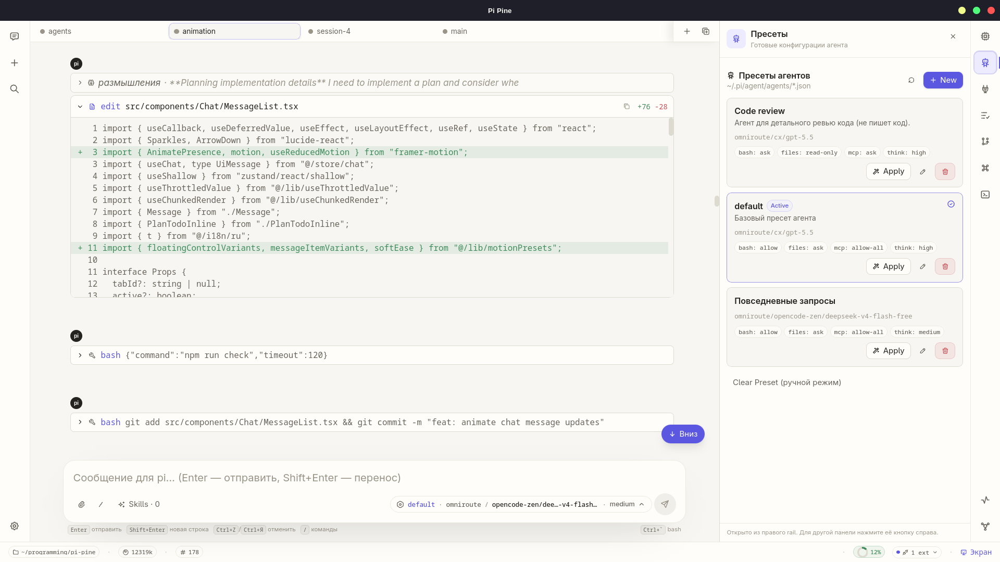
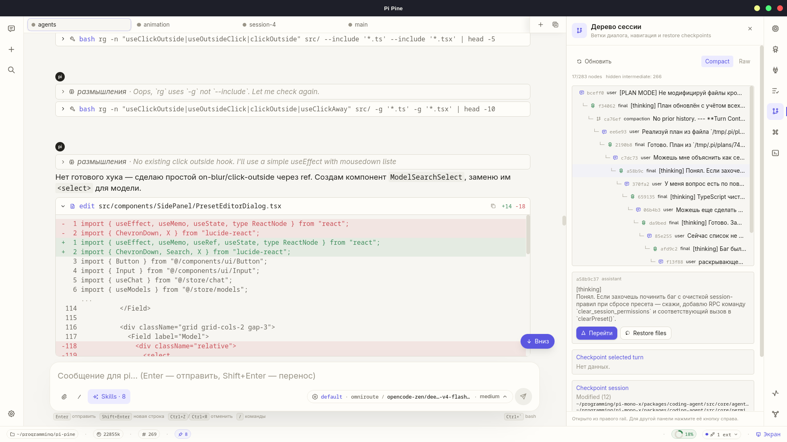
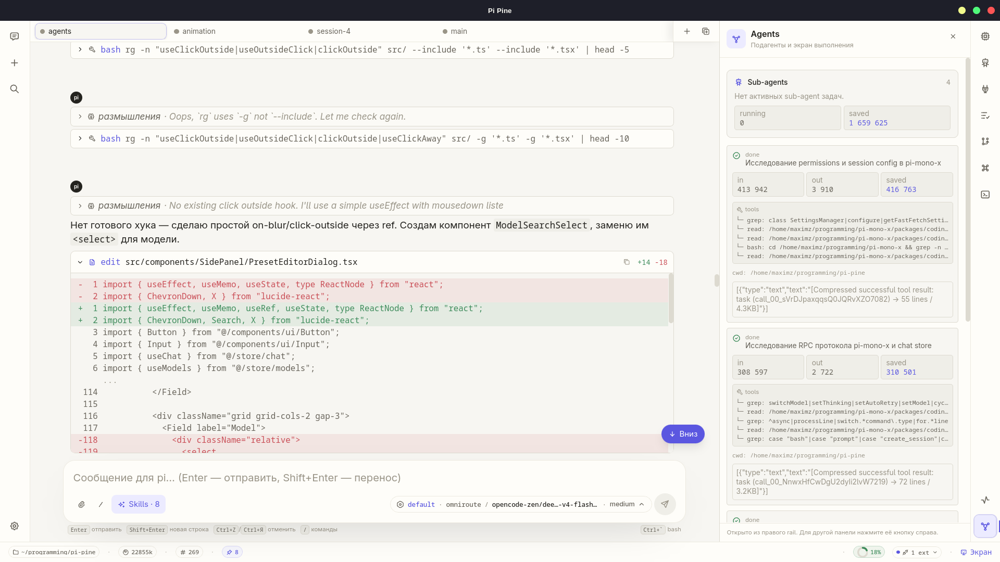
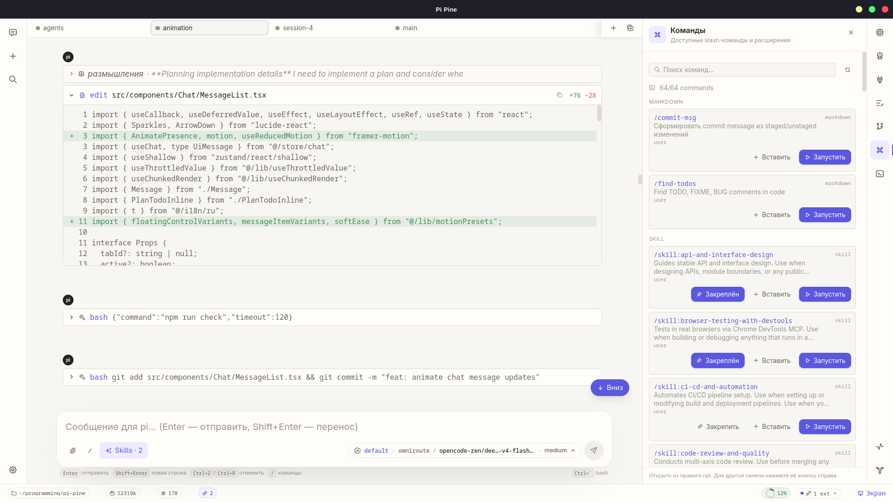
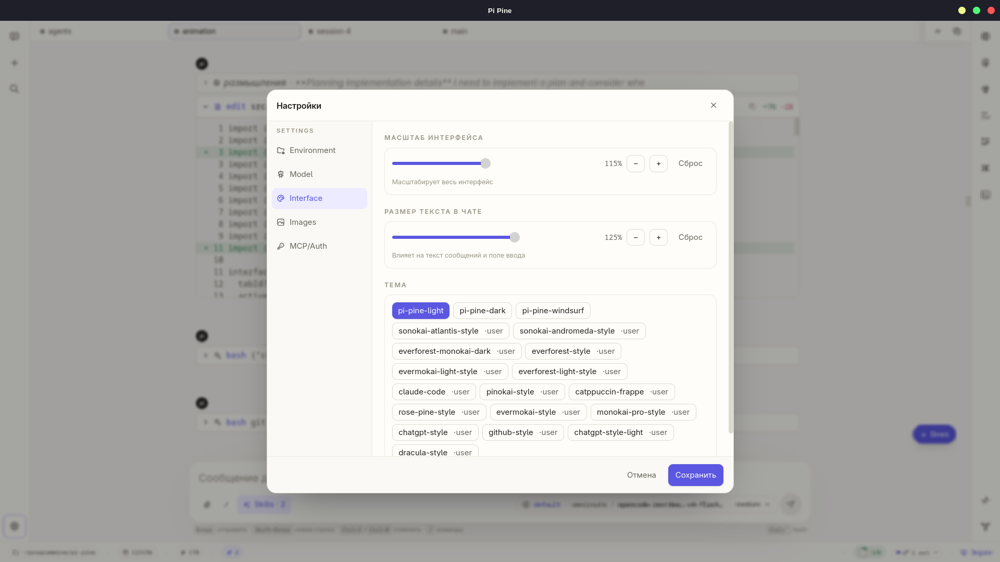

<p align="center">
    <picture>
        <source media="(prefers-color-scheme: dark)" srcset="assets/pi-pine-logo/logo-on-dark-1024.png" />
        <source media="(prefers-color-scheme: light)" srcset="assets/pi-pine-logo/logo-on-light-1024.png" />
        
    </picture>
</p>

<h1 align="center">Pi Pine</h1>

<p align="center">
    Минималистичный десктоп-клиент для <a href="https://github.com/BloodyAngel22/pi-mono-x">pi-mono-x</a> — форка AI-кодинг-агента <a href="https://pi.dev/">pi</a>.<br/>
    Убирает шум CLI, добавляет удобный UI, превращая работу с агентом в управляемый процесс.
</p>

> **Стек**: Tauri 2 · Rust · React 18 · TypeScript · Vite · Tailwind CSS 4 · Zustand · xterm.js  
> **Статус**: alpha / MVP (только Linux amd64)

---

## Скриншоты

<table>
<tr>
<td width="50%">

**Чат с tool-calls**



</td>
<td width="50%">

**Терминал**



</td>
</tr>
<tr>
<td width="50%">

**Модели — правая панель**



</td>
<td width="50%">

**Пресеты агентов**



</td>
</tr>
<tr>
<td width="50%">

**Дерево сессии**



</td>
<td width="50%">

**Sub-agents dashboard**



</td>
</tr>
<tr>
<td width="50%">

**Команды и скиллы**



</td>
<td width="50%">

**Настройки**



</td>
</tr>
</table>

---

## Чем отличается от pi CLI

| | pi CLI | Pi Pine |
|---|---|---|
| Интерфейс | Терминал | Нативный десктоп (Tauri 2, бинарь ~10 МБ) |
| Вывод thinking / tool-calls | Сырой поток в консоль | Компактные сворачиваемые блоки |
| Сессии | Флаги и файлы вручную | Вкладки, сайдбар, переименование, перетаскивание |
| Форк / регенерация / редактура | Нет | Встроено в UI каждого сообщения |
| Multi-session | Только последовательно | Параллельные вкладки с drag-and-drop |
| Терминал | Отдельное окно | Встроенный таб с xterm.js + split |
| Модель / Thinking | Флаги в CLI | Выбор из списка, поиск, пресеты |
| MCP-статусы | Смешаны с выводом | Отдельная панель, inline-статусы |
| План-режим | Нет | Plan mode с файлом плана и кнопкой «Реализуй» |
| Пресеты | Нет | Полноценная система: автозагрузка, permissions, model, thinking |
| Дерево сессии | Нет | Tree view: ветки, навигация, checkpoint restore |
| Sub-agents | Всё в консоль | Выделенный дашборд с метриками и логами |
| Deep Research | Не настраивается | Выбор режима (quick/balanced/deep) + прогресс |
| Управление cwd | `cd` в оболочке | `/cd` с Tab-автодополнением, кнопка выбора директории |
| Изображения | Нет | Вставка из буфера, OCR, captioning |
| Виртуальный дисплей | Нет | Изолированный Xvfb-экран для GUI-действий агента |

---

## Основные возможности

### Чат

- **Потоковый рендеринг** с автосклейкой `message_update`-дельт.
- **Thinking-блоки** — свёрнуты по умолчанию, разворачиваются по клику.
- **Tool-calls** — сворачиваемые блоки с diff-превью для edit/write, подкраской строк.
- **Fast Context** — индикатор в статус-баре с popover-просмотром найденных файлов.
- **Fast Fetch** — индикатор результатов веб-поиска/загрузки с превью контента.
- **Compaction** — визуализация сжатия контекста (токенов до/после).
- **Регенерация** — откат до родительского запроса с повторным запуском.
- **Форк** — создание отдельной ветки сессии от выбранного сообщения.
- **Редактура** — откат до выбранного запроса с подстановкой текста в поле ввода.
- **Ask User / Permission** — inline-карточки в чате (вместо модалок).
- **BTW (by the way)** — оверлей для попутных вопросов вне основного диалога.
- **Markdown** с подсветкой кода, нормализация вывода модели.
- **Undo/Redo** текста композера (по словам + таймер 300 мс).
- **Вставка изображений и файлов** из буфера обмена (Ctrl+V / Cmd+V).
- **Автосохранение** текста композера на уровне таба.

### Модель и мышление

- **Выбор модели** из `get_available_models` с поиском по provider/model.
- **Thinking level**: off → minimal → low → medium → high → xhigh.
- **Steering mode**: all / one-at-a-time.
- **Follow-up mode**: all / one-at-a-time.
- **Auto compaction / auto retry** с индикацией в статус-баре.

### Multi-session табы

- **Параллельные сессии** — каждая в своей вкладке.
- **Fork-таб** — новая вкладка, копирующая контекст текущей сессии.
- **Drag-and-drop** — перетаскивание вкладок для изменения порядка.
- **Переименование** — F2 / двойной клик / контекстное меню.
- **Индикаторы** — стриминг, ожидание permission/askUser, непрочитанные сообщения.
- **Персистентность** — содержимое табов сохраняется между переключениями.

### Slash-команды

| Команда | Действие | Запуск |
|---|---|---|
| `/new` | Новая сессия | Ctrl+N |
| `/forktab` | Форк-таб текущей сессии | — |
| `/sessions` | Сайдбар сессий | Ctrl+B |
| `/model` | Панель выбора модели | Ctrl+Shift+B |
| `/settings` | Настройки | Ctrl+, |
| `/compact` | Сжать контекст текущей сессии | — |
| `/search` | Поиск по истории промптов | Ctrl+F |
| `/execute` | Выполнить текущий план | — |
| `/abort` | Прервать стриминг | Esc |
| `/cd <path>` | Сменить cwd (с Tab-автодополнением) | — |
| `/pwd` | Показать текущую cwd | — |
| `/ls [path]` | Листинг файлов в директории | — |

`/cd` поддерживает автодополнение через Tab как в терминале: абсолютные (`/home/...`), относительные (`src/`), `~/` пути.

Также поддерживаются команды из установленных расширений и скиллов pi (напр. `/skill:name`).

### Палитра скиллов

- **Skills Palette** (`Ctrl+/`) — поиск и выбор `/skill:name` среди установленных скиллов pi.
- **Per-session pin** — закрепление скиллов за текущей сессией (кнопка в панели команд).
- **Автоподбор** — pi может автоматически предлагать скиллы под задачу.
- **Категории** — скиллы группируются по категориям в палитре.

### Панель команд (Commands Tab)

- Полный список всех доступных slash-команд, скиллов и MCP-расширений.
- **Поиск** по названию, описанию, источнику.
- **Pin-кнопка** для закрепления скилла за сессией.
- **Запуск** команды напрямую из панели.
- Группировка по источнику (builtin, skill, extension, template).

### Терминал

- **Встроенный терминал** на базе xterm.js + portable-pty (Rust).
- Переключение чат / терминал: таб или `Ctrl+\``.
- **Split** (вертикальный) — два терминала одновременно.
- **Nerd Fonts** (Unicode 11) — ZSH-иконки, powerline-шрифты.
- **Adaptive resize** — коррекция размеров для tmux и split panes.
- Буфер и состояние сохраняются при переключении табов.

### Сессии

- **Сайдбар сессий** (`Ctrl+B`) — список `.jsonl`-файлов, переключение, переименование, удаление, обрезка.
- **Дерево сессии** (Tree Tab) — визуализация ветвления с compact/raw режимами.
    - Навигация к любому узлу, восстановление файлового checkpoint.
- **Поиск по истории** (`Ctrl+F`) — поиск промптов в текущей сессии.
- **Last session** — автоматическое восстановление последней сессии при старте.

### План и скиллы

- **Plan Mode** — кнопка Plan в заголовке: pi пишет план в `/tmp/.pi/plans/<id>.md`, не редактируя код.
- **«Реализуй»** — запуск выполнения текущего плана (кнопка `▶` или `/execute`).
- **Счётчик задач** — визуализация количества задач в плане.
- **Plan Tab** — просмотр и редактирование файла плана в side panel.

### Пресеты агентов

- **Создание / редактирование / удаление** пресетов (хранятся в `~/.pi/agent/agents/*.json`).
- **Автозагрузка** по `projectCwd` — автоматический выбор пресета при входе в каталог проекта.
- **Apply** — одним кликом применить пресет к текущей сессии.
- **Параметры пресета**:
    - Модель (provider/model)
    - Thinking level
    - Permissions: bash (ask/allow/read-only/deny), files (ask/allow/read-only/deny)
    - MCP permissions (ask/allow-all/deny-all)
    - System prompt
    - Auto retry / auto compaction
    - Steering / follow-up modes
- **Clear Preset** — возврат к ручному управлению.

### Side panel (правая панель)

| Вкладка | Назначение |
|---|---|
| **Models** | Выбор provider/model с поиском, указание thinking level |
| **Presets** | CRUD пресетов агентов, Apply/Clear |
| **MCP** | Список серверов расширений, включение/отключение, статусы |
| **Status** | RPC-статус, окружение, диагностика |
| **Plan** | Просмотр/редактирование файла текущего плана |
| **Tree** | Дерево сессии, навигация по сообщениям, restore checkpoint |
| **Agents** | Sub-agents: активные задачи, метрики (in/out/saved токены), лог активности |
| **Commands** | Все slash-команды и скиллы, поиск, пины, запуск |

Открывается кнопкой в правом rail или `Ctrl+Shift+B`.

### Sub-agents

- **Dashboard** в панели Agents: список всех task-вызовов, статусы, описание, агент.
- **Метрики**: input tokens, output tokens, saved tokens.
- **Лог активности** — список действий субагента (tools, fetch, search).
- Индикация running и общего числа сэкономленных токенов.

### Deep Research

- **Прогресс UI** — визуализация хода deep_research в чате.
- **Настройка режима** по умолчанию (quick / balanced / deep) в настройках.
- Быстрый ≈5 мин / сбалансированный ≈10 мин / глубокий ≈20 мин.

### Изображения и файлы

- **Вставка из буфера** — Ctrl+V из браузера / файлового менеджера.
- **Анализ изображений**:
    - **OCR** (Tesseract) — распознавание текста на картинках.
    - **Captioning** (transformers.js / vit-gpt2) — генерация описания.
- Настройка языков OCR, выбор бэкенда captioning.
- Индикатор кеша моделей в настройках.
- **Копирование пути файла** в блоке tool call — клик по пути копирует.

### Статус-бар

Компактная строка внизу окна:

- **cwd** — текущая рабочая директория (усечённая, с тултипом).
- **Токены** — total tokens сессии.
- **Сообщения** — количество сообщений в сессии.
- **Стоимость** — стоимость API-запросов.
- **Fast Fetch** / **Fast Context** — индикаторы и popover-просмотр.
- **Context usage** — круговой индикатор заполнения контекстного окна.
- **Compacting / Retry** — индикаторы активных процессов.
- **YOLO mode** — статус автоматического одобрения.
- **Extensions** — пилюля статусов MCP-расширений.
- **Экран агента** — кнопка открытия виртуального дисплея.

### Виртуальный дисплей

- **Изолированный Xvfb-дисплей** (`:99`) для GUI-действий агента.
- **Openbox** — оконный менеджер для корректной работы оконных приложений.
- **x11vnc** (порт 5900) — просмотр в реальном времени.
- **Скриншоты** — автоматический захват каждые 1.5 с при открытом окне просмотра.
- **Старт/стоп** — из интерфейса, с индикацией статуса.
- Кнопка «Экран» в статус-баре — открывает просмотр экрана агента.

### Настройки

- **Окружение** — путь к pi, cwd, deep research mode.
- **Модель** — выбор провайдера и модели, thinking level.
- **Интерфейс** — масштаб UI (zoom) и отдельно размер шрифта чата.
- **Темы** — выбор из встроенных (тёмная / светлая) и пользовательских (из `~/.pi/agent/themes/`).
- **Изображения** — OCR и captioning для анализируемых изображений.
- **Авторизация** — просмотр `auth.json`, список провайдеров.
- **MCP** — управление серверами расширений (вкл/выкл).

### Горячие клавиши

| Клавиша | Действие |
|---|---|
| `Ctrl+B` | Сайдбар сессий |
| `Ctrl+Shift+B` | Правая панель (Models / MCP / Status / …) |
| `Ctrl+,` | Настройки |
| `Ctrl+N` | Новая сессия (вкладка) |
| `Ctrl+W` | Закрыть текущую вкладку |
| `Ctrl+Tab` / `Ctrl+Shift+Tab` | Следующая / предыдущая вкладка |
| `Ctrl+\`` | Переключение чат / терминал |
| `Ctrl+/` | Палитра скиллов |
| `Ctrl+F` | Поиск по истории промптов |
| `Enter` | Отправить сообщение |
| `Shift+Enter` | Перенос строки |
| `↑` / `↓` | История ввода (когда поле пустое) |
| `Esc` | Прервать стриминг / закрыть оверлей |
| `Tab` | Автодополнение slash-команд и директорий (`/cd`) |
| `F2` | Переименовать текущую вкладку |
| `Ctrl+Z` / `Ctrl+Shift+Z` | Undo / Redo текста композера |

### Splash screen и загрузка

- **Splash** отображает пошаговую загрузку: инициализация → детект окружения → запуск pi.
- **Boot-логи** — реальные события прогресса, ограниченные по количеству строк.
- **Pi Missing Card** — если бинарник pi не найден: поиск, ручной ввод пути, кнопка повтора.
- **Диагностика** в панели Status: версия, пути, auth, MCP.

---

## Сборка и запуск

```bash
# dev-сервер с горячей перезагрузкой
npm run tauri:dev

# production-сборка
npm run tauri:build

# быстрая сборка без бандлов
npx tauri build --no-bundle

# запуск готового бинаря
./src-tauri/target/release/pi-pine .

# с явным cwd
./src-tauri/target/release/pi-pine ~/projects/myapp
```

### Требования

- **[pi-mono-x](https://github.com/BloodyAngel22/pi-mono-x)** — форк pi с расширенным RPC-протоколом.  
  Pi Pine **не совместим** с оригинальным [pi](https://pi.dev/).
  ```bash
  git clone --branch feature/pi-pine-rpc-integration https://github.com/BloodyAngel22/pi-mono-x
  cd pi-mono-x
  npm install
  npm run build
  ```

- **Node.js ≥ 22**, **Rust** (stable), **libwebkit2gtk-4.1-dev**, **librsvg2-dev**.

  ```bash
  sudo apt install libwebkit2gtk-4.1-dev librsvg2-dev
  ```

Pi Pine ищет бинарник `pi` в `PATH`, `~/.nvm/`, `~/.volta/`, `~/.local/share/fnm/`.  
Если не нашёл — укажите путь вручную в настройках (⚙ → Путь к pi).

---

---

## Архитектура

```
React UI (Vite + Tailwind + Zustand + xterm.js)
  ↕  invoke / listen  (@tauri-apps/api)
Tauri (Rust): rpc.rs · terminal.rs · paths.rs · sessions.rs · plans.rs · mcp.rs · themes.rs · agents.rs · favorites.rs · analyze_image.rs · virtual_display.rs · clipboard.rs
  ↕  stdin/stdout JSONL           ↕  portable-pty
pi --mode rpc  (pi-mono-x)                 shell (bash/zsh)
  ↕
~/.pi/agent/{auth,settings,sessions,extensions,mcp-config,agents,themes,favorites}.*
```

### Rust-модули (`src-tauri/src/`)

| Модуль | Назначение |
|---|---|
| `lib.rs` | Точка входа, регистрация всех Tauri-команд |
| `rpc.rs` | Спавн `pi --mode rpc`, JSONL-парсер, очистка ANSI, события `rpc://line/stderr/closed` |
| `terminal.rs` | PTY-терминал через portable-pty: spawn, write, resize, kill, list |
| `paths.rs` | Поиск `pi`, автодополнение директорий, auth.json watcher, detect_environment |
| `sessions.rs` | Список, переименование, удаление, обрезка `.jsonl`-файлов, last-session persistence |
| `plans.rs` | Режим плана: CRUD markdown-файлов в `/tmp/.pi/plans/` |
| `mcp.rs` | Чтение/редактирование `mcp-config.json`, включение/отключение серверов |
| `themes.rs` | Встроенные (dark/light) и пользовательские темы из `~/.pi/agent/themes/` |
| `agents.rs` | Пресеты агентов: CRUD, автозагрузка по cwd, RPC-load |
| `favorites.rs` | Избранные модели/провайдеры, чтение/запись pi settings |
| `analyze_image.rs` | OCR (Tesseract), captioning (transformers.js), поиск моделей |
| `virtual_display.rs` | Xvfb :99 + openbox + x11vnc: управление, скриншоты |
| `clipboard.rs` | Чтение `text/uri-list` из буфера обмена |

### Frontend-модули (`src/`)

| Модуль | Назначение |
|---|---|
| `rpc/bridge.ts` | Типизированный JSONL-RPC мост с сопоставлением запрос/ответ по id |
| `rpc/types.ts` | Все типы протокола `pi --mode rpc` |
| `store/chat.ts` | Zustand: стриминг, табы, форк, регенерация, cwd-команды, fast context/fetch, plan |
| `store/ext.ts` | Zustand: Extension UI (permissions, toasts, statuses, диалоги) |
| `store/models.ts` | Zustand: список доступных моделей/провайдеров |
| `store/theme.ts` | Zustand: загрузка и применение тем |
| `store/agents.ts` | Zustand: пресеты агентов (CRUD, select, автозагрузка) |
| `store/virtualDisplay.ts` | Zustand: виртуальный дисплей (старт/стоп/скриншот/polling) |
| `store/uiPrefs.ts` | Zustand: настройки UI (масштаб, размер чата, ширина панелей, deep-research mode) |
| `components/` | React-компоненты (см. структуру ниже) |
| `terminal.ts` | xterm.js с Tauri invoke-мостом |
| `themes/loader.ts` | Загрузчик CSS-переменных из toml-тем |

### Ключевые компоненты

| Компонент | Назначение |
|---|---|
| `App.tsx` | Корневой компонент: загрузка, сплэш, layout, клавиатурные шорткаты |
| `MessageList.tsx` | Список сообщений с lazy-рендером, автоскроллом |
| `Message.tsx` | Рендер одного сообщения: разбор сегментов text/skill/tool |
| `Composer.tsx` | Поле ввода: slash-меню, cd-autocomplete, undo/redo, attachements, plan-кнопка |
| `ToolCall.tsx` | Блок tool-call: diff-превью, статусы, иконки по типу инструмента, изображения |
| `ThinkingBlock.tsx` | Сворачиваемые размышления агента |
| `SessionTabs.tsx` | Табы сессий: drag-and-drop, rename, индикаторы, контекстное меню |
| `SessionsSidebar.tsx` | Сайдбар сессий слева: список, поиск, rename, delete, truncate |
| `SidePanel.tsx` | Правая панель с переключаемыми вкладками |
| `StatusBar.tsx` | Статус-бар: cwd, токены, стоимость, контекст, fast-context/fetch, расширения |
| `TerminalPanel.tsx` | Панель терминала: xterm.js, split, resize |
| `SettingsModal.tsx` | Модалка настроек с табами: окружение, модель, интерфейс, темы, изображения, auth |
| `AgentScreen.tsx` | Просмотр виртуального дисплея агента |
| `BtwOverlay.tsx` | Оверлей попутных вопросов |
| `DialogQueue.tsx` | Очередь Extension UI диалогов |
| `ExtensionsPill.tsx` | Пилюля статусов MCP-расширений в статус-баре |

---

## Где хранятся данные

| Путь | Назначение |
|---|---|
| `~/.pi/agent/auth.json` | Токены провайдеров (чтение + автоотслеживание) |
| `~/.pi/agent/settings.json` | Настройки CLI (чтение/запись) |
| `~/.pi/agent/sessions/<encoded-cwd>/*.jsonl` | Файлы сессий |
| `~/.pi/agent/mcp-config.json` | Конфигурация MCP-серверов |
| `~/.pi/agent/extensions/mcp/` | MCP-расширения pi |
| `~/.pi/agent/agents/*.json` | Пресеты агентов |
| `~/.pi/agent/themes/*.toml` | Пользовательские темы |
| `~/.pi/agent/favorites.json` | Избранные модели и провайдеры |
| `/tmp/.pi/plans/` | Файлы планов |

Кодирование cwd: `/home/user/foo` → `--home-user-foo--` (совместимо с pi CLI).

---

## Известные ограничения

- Только Linux (webkit2gtk). macOS/Windows — в планах.
- Protocol Extension UI (`ctx.ui.notify/select/confirm/input/editor`) — частичная поддержка.
- Дерево файлов и просмотр diff — не реализованы.
- Полноценная темизация плагинов — не реализована.

---

## Устранение проблем

**`pi` не найден при запуске**  
→ Соберите [pi-mono-x](https://github.com/BloodyAngel22/pi-mono-x) и добавьте бинарь в `PATH`.  
→ Или укажите путь в настройках (⚙ → «Путь к pi»).  
→ Используйте кнопку «Поиск» — Pi Pine проверит `PATH`, nvm, volta, fnm.

**Ошибка webkit/librsvg при сборке**  
→ `sudo apt install libwebkit2gtk-4.1-dev librsvg2-dev`

**Сессии не отображаются в сайдбаре**  
→ Проверьте, что cwd совпадает с тем, где создавались сессии.  
→ Pi хранит сессии в `~/.pi/agent/sessions/<encoded-cwd>/`.

**MCP не инициализируется / зависает**  
→ Проверьте конфиг MCP в настройках (⚙ → MCP).  
→ Попробуйте «Безопасный режим» (кнопка в баннере ошибки — сброс provider/model).

**Терминал: иконки ZSH/powerline не отображаются**  
→ Установите шрифт с Nerd Fonts (MesloLGS NF, JetBrainsMono NF).

**Терминал не открывается**  
→ Проверьте `$SHELL` — используется оболочка по умолчанию.

---

## Лицензия

MIT — см. [LICENSE](LICENSE).
